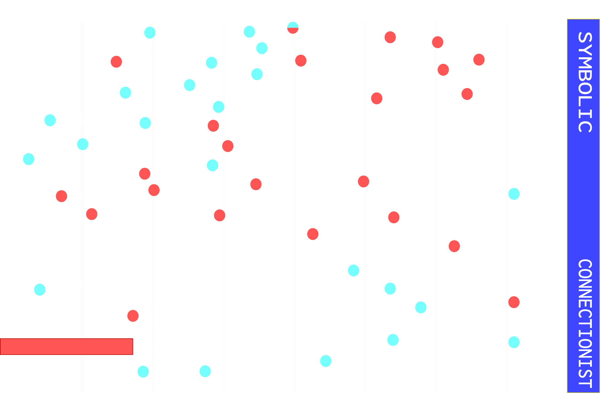
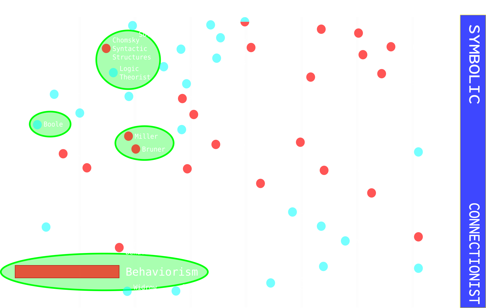
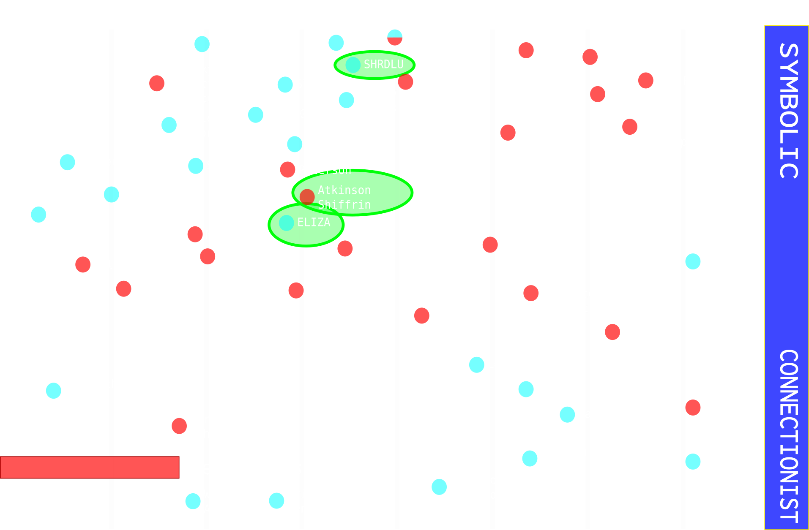
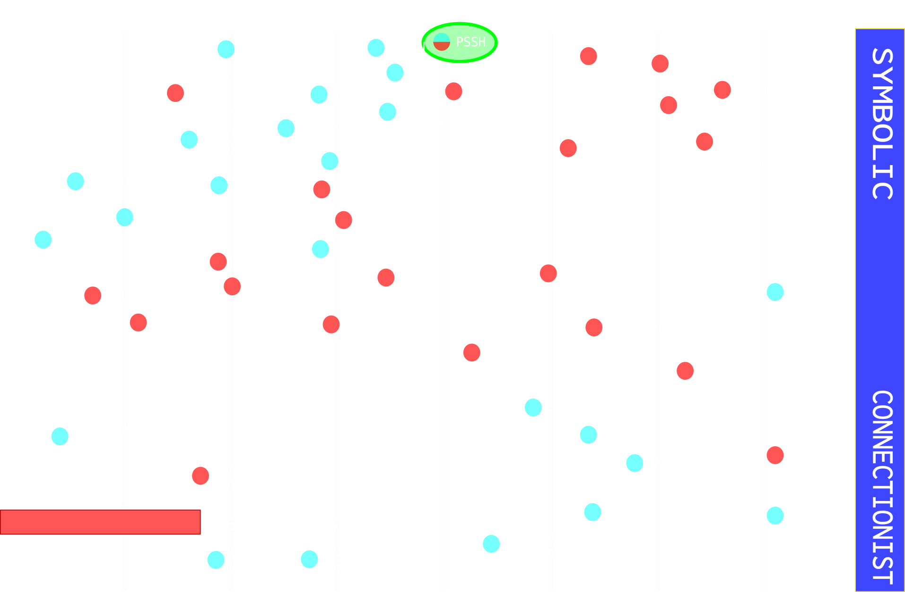
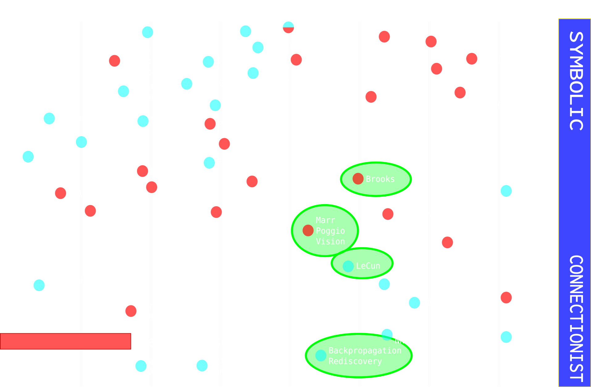
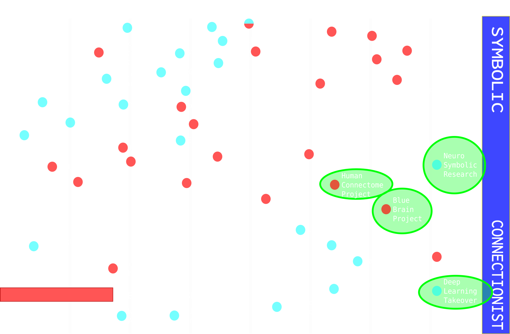
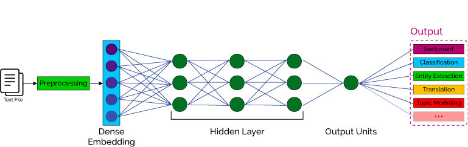
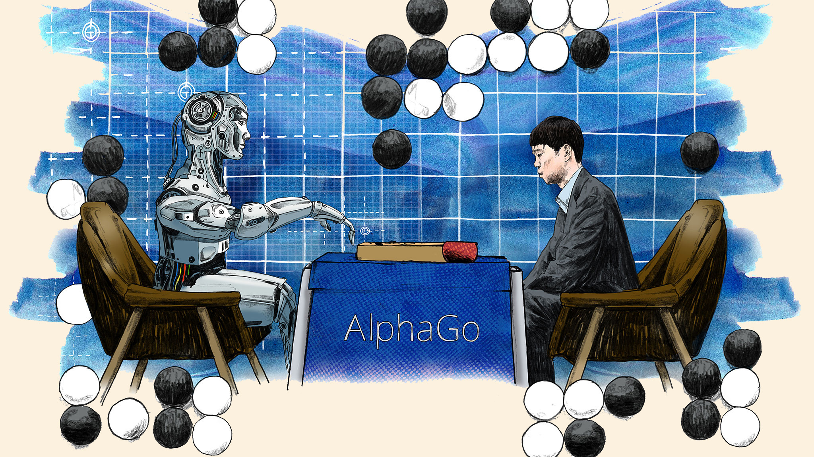
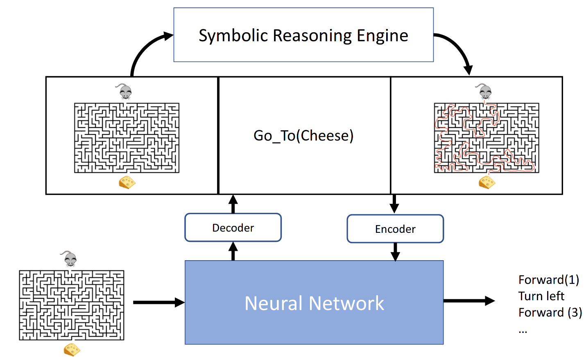

# Cognitive Science and Artificial Intelligence
### An interwoven approach

**Supervisor**: Francesco Bianchini
**Author**: Paolo Marzolo

---
## What was studied
History of *cognitive science(s)*, compared and contrasted with the history of *artificial intelligence* and *computer science*. Main interest: are theories...
- **symbol**-oriented: localized representation, high level reasoning, distance from biology
- **connection**-oriented: distributed representation, interest in low level processing, perception, closely related to biology

---
## Rationale behind research

Their shared histories have influenced one another many times. 
- What is there to learn from Cognitive Sciences now?
- Are old paradigms relevant again?
- Which directions seem to hold the most promise?
- What's the current state of research?
---

## Structure of the thesis
- Glossary: included to avoid *weighted* terms
- Historical section: developed in sections, highlights shifts in perspective
- Analysis: 
    - Trends and movements
    - Symbols, subsymbols and hybrid approaches
- Appendix: introduction to neural networks moved here to keep text light
---

## Structure of this presentation
Instead of sections, we'll go through some interesting points throughout the history. 

Then, we'll tackle symbols-subsymbols briefly.

---

---
# 1950-56

---
## 1950-56
### Climate and pivotal year

- Boole
- Behaviorism (+past)
- Dartmouth College Workshop
- Miller "7", Bruner-Goodnow-Austin "A Study of Thinking"
- Chomsky 1957

---
# 1970

---
## 1970
### Symbols
- SHRDLU
- ELIZA
- Atkinson Shiffrin memory model

---
# 1980

---
## 1980
### Expert Systems

- 1976 PSSH
- Expert Systems (MYCIN, Dendral)
- Computational Theory of Mind

---
# 1990

---

## 1990
### Embodiment

- Brooks 1990
- Connectionism (LeCun, backpropagation)
- Computational Neuroscience, Modularism

---
# NOW

---

## "NOW"

- Deep learning:
    - Image processing
    - Natural Language Processing

- Neuro-symbolic Reasoning

- Human Connectome, Human brain project

---

## Symbolic-neuro integration

---
<!-- _class: -->
### Symbolic - neuro - symbolic
- normal neural networks
- standard approach

- 
---

### Symbolic\[Neuro\]

- Monte Carlo Tree Search + NN for state estimation
- Self driving cars
- Great success in game-playing

---
<!-- _class: -->
## Neuro; Symbolic

From neuro perception to symbolic reasoning 
(Neuro Symbolic Concept Learner)

---

## Neuro: Symbolic -> Neuro
- Training converts symbolic rules to training pairs
- No correctness guarantee
- E.g: Deep Learning for Symbolic Mathematics

---

## **Neuro**_Symbolic

- Using symbolic rules as guidelines or *templates* for connectionist structures
- Logic Tensor Networks:
    - formulas -> fuzzy logical reasoning
    - object features -> error minimization
    - all in Neural Network
---
<!-- _class: -->

## Neuro \[Symbolic\]
Kautz ends on these hypothetical models, which would be able to encode and decode into and from a **symbolic** reasoning engine

---

# Conclusion
In this presention, we went over some relevant passages of the thesis. After some history, we went over the difference between symbol and subsymbol-representations, and ways to integrate them.

---

Sources not included in thesis bibliography:
- [Kautz slides](https://www.cs.rochester.edu/u/kautz/talks/Kautz%20Engelmore%20Lecture%20Directors%20Cut.pdf)
- [Logic Tensor Networks](https://arxiv.org/pdf/1606.04422.pdf)
- [Deep Learning for Symbolic Mathematics](https://arxiv.org/abs/1912.01412)
- images: [NN](https://deepai.org/machine-learning-glossary-and-terms/natural-language-processing), [AlphaGO](http://prod-upp-image-read.ft.com/4bb1cd86-0a48-11e7-ac5a-903b21361b43), [NSCL](http://nscl.csail.mit.edu/)

Please find all other historical sources in the thesis bibliography

---

# Thanks!